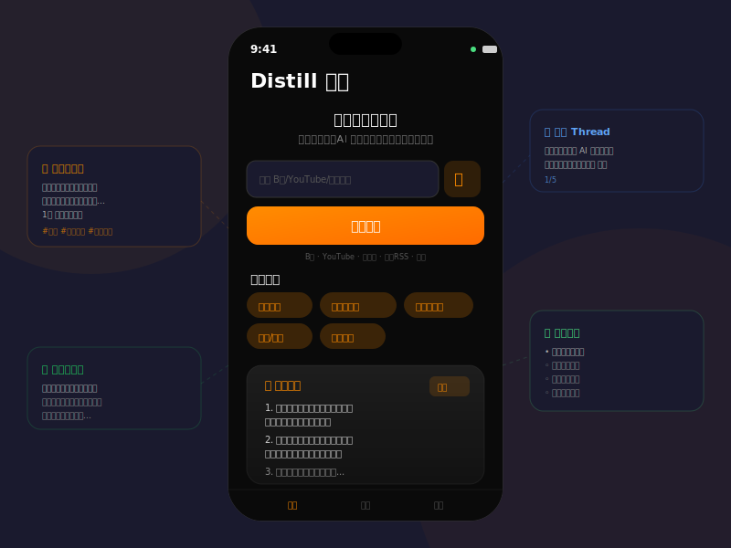

<p align="center">
  
</p>

<h1 align="center">Distill 炼金</h1>

<p align="center">
  <b>把长内容炼成金 — 本地优先的 AI 内容提炼工具</b><br>
  <b>Turn long-form content into gold — a local-first AI content distiller</b>
</p>

<p align="center">
  
  
  
</p>

---

## 中文

### 简介

Distill 炼金是一款 iOS 应用，能将长音频/视频内容在设备端转录，并通过 AI 自动提炼为可直接发布的社交媒体内容。

**一句话概括：** 听完一个播客，摇身一变就是 10 条小红书笔记。

### 核心特性

- **🔒 本地转录** — 使用 WhisperKit 在设备端完成语音转文字，音视频不出手机
- **🤖 AI 提炼** — 接入 DeepSeek / OpenAI 等大模型，智能提取核心内容
- **📱 多平台格式** — 一键生成小红书笔记、公众号草稿、推特/即刻帖子、学习笔记
- **🎙️ 多种输入** — 支持导入音视频文件、现场录音
- **📋 即刻分享** — 生成的内容可一键复制或通过系统分享发送

### 输出格式

| 格式 | 说明 |
|------|------|
| 金句摘录 | 5-10 条核心观点和精彩表达 |
| 小红书笔记 | 带 emoji 和话题标签的完整笔记 |
| 公众号草稿 | 结构化长文，可直接编辑发布 |
| 推特/即刻 | 5 条独立短内容，适合社交传播 |
| 要点笔记 | 大纲格式的结构化学习笔记 |

### 使用场景

- **知识博主** — 听完播客/演讲，一键转化为多条发布素材
- **自媒体运营** — 高效拆解长视频内容，分发到多个平台
- **学习者** — 网课/讲座自动生成结构化笔记，方便复习

### 技术栈

- **UI**: SwiftUI
- **转录**: [WhisperKit](https://github.com/argmaxinc/WhisperKit) (on-device, CoreML)
- **LLM**: DeepSeek / OpenAI / 自定义 API
- **音频**: AVFoundation
- **构建**: XcodeGen

### 快速开始

```bash
# 克隆仓库
git clone https://github.com/Muluk-m/distill.git
cd distill

# 生成 Xcode 项目（需要安装 xcodegen）
brew install xcodegen
xcodegen generate

# 用 Xcode 打开
open Distill.xcodeproj
```

> 首次 build 会自动下载 WhisperKit 模型（约 150MB）。需要在设置中配置 API Key 才能使用 AI 提炼功能。

---

## English

### Introduction

Distill is an iOS app that transcribes long audio/video content on-device and uses AI to automatically extract publishable social media content.

**In one sentence:** Listen to a podcast, instantly get 10 ready-to-post social media entries.

### Key Features

- **🔒 On-Device Transcription** — WhisperKit-powered speech-to-text runs entirely on your iPhone. Your media never leaves the device.
- **🤖 AI-Powered Extraction** — Connects to DeepSeek / OpenAI / custom LLMs to intelligently distill key insights.
- **📱 Multi-Platform Output** — Generates content formatted for Xiaohongshu (RED), WeChat articles, Twitter/Jike threads, and study notes.
- **🎙️ Flexible Input** — Import audio/video files or record directly in-app.
- **📋 Instant Sharing** — One-tap copy or share via iOS share sheet.

### Output Formats

| Format | Description |
|--------|-------------|
| Highlights | 5-10 key quotes and core insights |
| Xiaohongshu Post | Complete post with emojis and hashtags |
| WeChat Draft | Structured long-form article |
| Twitter/Jike Thread | 5 standalone short posts for social media |
| Study Notes | Hierarchical outline-style notes |

### Use Cases

- **Content Creators** — Turn podcasts and talks into multi-platform publishing material
- **Social Media Managers** — Efficiently repurpose long-form video into bite-sized content
- **Learners** — Auto-generate structured notes from lectures and online courses

### Tech Stack

- **UI**: SwiftUI
- **Transcription**: [WhisperKit](https://github.com/argmaxinc/WhisperKit) (on-device, CoreML)
- **LLM**: DeepSeek / OpenAI / Custom API
- **Audio**: AVFoundation
- **Build**: XcodeGen

### Getting Started

```bash
# Clone the repo
git clone https://github.com/Muluk-m/distill.git
cd distill

# Generate Xcode project (requires xcodegen)
brew install xcodegen
xcodegen generate

# Open in Xcode
open Distill.xcodeproj
```

> The first build will automatically download the WhisperKit model (~150MB). You'll need to configure an API key in Settings to use the AI distillation feature.

---

## Roadmap

- [ ] URL import (Bilibili, YouTube, podcast RSS)
- [ ] On-device LLM (Ollama-style, fully offline)
- [ ] Custom prompt templates
- [ ] Export as image cards
- [ ] History & local storage
- [ ] Apple Watch companion (record & sync)

## License

MIT
